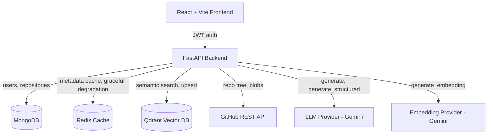
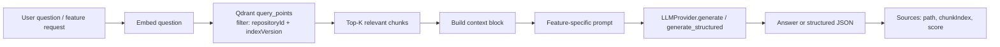
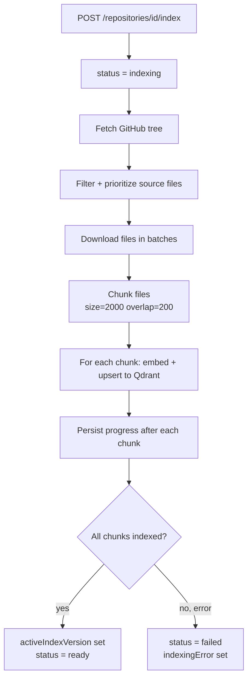

# AI Software Engineering Copilot

An intelligent platform that ingests GitHub repositories and provides AI-powered,
repository-aware software engineering assistance: code explanation, bug detection,
security analysis, optimization recommendations, test generation, API documentation,
UML/architecture diagrams, and deployment planning — all grounded in a RAG pipeline
over the repository's own code.

This repository contains the **Python/FastAPI backend** (migrated from the original
Node.js/Express backend) and the existing **React/Vite frontend**, which required no
functional rewrite — only a couple of new UI components to render the richer,
structured AI output.

---

## 1. Architecture



## 2. RAG pipeline



## 3. Indexing pipeline



State machine: `not_indexed -> indexing -> ready | failed`. Indexing runs as an
asyncio background task so the HTTP request returns `202 Accepted` immediately;
`GET /index-status` reports live progress.

---

## 4. Tech stack

| Layer            | Technology                                             |
|-------------------|--------------------------------------------------------|
| Frontend          | React, Vite, React Router, CSS                        |
| Backend           | Python 3.14, FastAPI, Pydantic v2                      |
| Database          | MongoDB (Motor async driver)                           |
| Cache             | Redis (redis-py, async, graceful degradation)          |
| Vector database   | Qdrant (qdrant-client, current `query_points()` API)   |
| LLM               | Gemini, behind an `LLMProvider` abstraction             |
| Embeddings        | Gemini, behind an `EmbeddingProvider` abstraction       |
| Auth              | JWT (python-jose) + bcrypt password hashing             |
| GitHub            | GitHub REST API via httpx                               |
| Testing           | pytest, pytest-asyncio, mongomock-motor, fakeredis, respx |

---

## 5. Project structure

```
backend/
├── app/
│   ├── main.py                     # App wiring, CORS, logging middleware, health check
│   ├── core/
│   │   ├── config.py                # Pydantic settings, validates env vars at startup
│   │   ├── security.py              # bcrypt hashing, JWT create/decode
│   │   ├── logging.py               # Structured logging + secret redaction
│   │   └── exceptions.py            # Centralized error handling -> {success, message}
│   ├── db/
│   │   ├── mongodb.py                # Motor connection
│   │   ├── redis.py                  # Redis connection, never crashes if unavailable
│   │   └── qdrant.py                 # Qdrant connection
│   ├── models/
│   │   ├── user.py                   # users collection helpers
│   │   └── repository.py             # repositories collection + indexing state machine
│   ├── schemas/
│   │   ├── auth.py, repository.py, indexing.py, rag.py
│   │   └── ai.py                     # Structured JSON schemas for every AI feature
│   ├── api/
│   │   ├── deps.py                   # JWT auth dependency
│   │   └── routes/                   # auth, repositories, indexing, rag, explanation,
│   │                                 # bugs, security, optimization, uml, tests,
│   │                                 # documentation, deployment
│   └── services/
│       ├── github/                   # GitHub API client, ingestion, prioritization
│       ├── chunking/                 # Code-aware chunking
│       ├── embeddings/               # EmbeddingProvider abstraction + Gemini impl
│       ├── vector/                   # Qdrant operations (query_points, not .search())
│       ├── rag/                      # RetrievalService, PromptService, RAG Q&A
│       ├── indexing/                 # Async background indexing pipeline
│       └── ai/                       # LLMProvider abstraction + Gemini impl + AIService
├── tests/                            # pytest suite, all external services mocked
├── requirements.txt
├── pytest.ini
└── .env.example

frontend/                             # Unchanged React/Vite app (see section 8)
```

---

## 6. API reference

All responses follow `{ "success": bool, "message"?: str, ... }`. Interactive docs are
served at `/docs` (Swagger) and `/redoc`.

| Method | Path                                         | Auth | Description                          |
|--------|-----------------------------------------------|------|---------------------------------------|
| GET    | `/health`                                     | No   | Health check: `{"status": "ok"}`      |
| POST   | `/api/auth/register`                          | No   | Register a new user                   |
| POST   | `/api/auth/login`                             | No   | Log in, receive a JWT                 |
| POST   | `/api/auth/logout`                            | No   | Stateless no-op                       |
| GET    | `/api/auth/profile`                           | Yes  | Current user's profile                |
| POST   | `/api/repositories`                           | Yes  | Import a GitHub repository            |
| GET    | `/api/repositories`                           | Yes  | List the user's repositories          |
| GET    | `/api/repositories/{id}`                      | Yes  | Get one repository                    |
| DELETE | `/api/repositories/{id}`                      | Yes  | Delete a repository                   |
| POST   | `/api/repositories/{id}/index`                | Yes  | Start background indexing (202)       |
| GET    | `/api/repositories/{id}/index-status`         | Yes  | Poll indexing progress                |
| POST   | `/api/repositories/{id}/ask`                  | Yes  | RAG question answering                |
| POST   | `/api/repositories/{id}/explain`              | Yes  | Explain a file/function/feature       |
| POST   | `/api/repositories/{id}/bugs`                 | Yes  | Structured bug analysis               |
| POST   | `/api/repositories/{id}/security`             | Yes  | Structured security analysis          |
| POST   | `/api/repositories/{id}/optimize`             | Yes  | Structured optimization recommendations|
| POST   | `/api/repositories/{id}/uml`                  | Yes  | Architecture diagram (Mermaid)        |
| POST   | `/api/repositories/{id}/tests`                | Yes  | Structured generated tests            |
| POST   | `/api/repositories/{id}/documentation`        | Yes  | Structured API documentation          |
| POST   | `/api/repositories/{id}/deployment`           | Yes  | Deployment / CI/CD recommendations    |

---

## 7. Environment variables

See `backend/.env.example` for the full list with defaults. Required (no default):
`MONGODB_URI`, `JWT_SECRET`, `LLM_API_KEY`. Everything else has a sensible default for
local development.

---

## 8. Local setup

### Backend

```bash
cd backend
python3.14 -m venv .venv && source .venv/bin/activate
pip install -r requirements.txt
cp .env.example .env   # then fill in MONGODB_URI, JWT_SECRET, LLM_API_KEY

uvicorn app.main:app --reload --host 0.0.0.0 --port 8000
```

Requires **Python 3.14+** (developed and CI-tested against 3.14.7 — see `.python-version`).
Every pinned dependency in `requirements.txt` has a confirmed `cp314` wheel on PyPI, so
`pip install` does not need to compile anything from source.

Requires local (or remote) MongoDB, Redis, and Qdrant instances reachable at the URLs
in `.env`. Redis is optional in the sense that the app degrades gracefully without it.

### Frontend

```bash
cd frontend
npm install
cp .env.example .env   # VITE_API_URL=http://localhost:8000/api
npm run dev
```

---

## 9. Testing

```bash
cd backend
pytest -q
```

All 41 tests pass. Every external service (MongoDB, Redis, Qdrant, GitHub, the LLM,
and the embedding provider) is mocked or run in-memory, so the suite never depends on
real external APIs or network access:

- MongoDB -> `mongomock-motor` (in-memory async Mongo)
- Redis -> `fakeredis` (in-memory async Redis)
- Qdrant -> real `qdrant-client` pointed at `location=":memory:"` (so `query_points()`
  and `upsert()` are exercised exactly as in production)
- GitHub -> `respx` intercepting `httpx` calls
- LLM / embeddings -> fake provider implementations behind the same abstractions
  production code uses

Coverage: registration/login/duplicate-email/invalid-input/wrong-password/unknown-user/
unauthorized, repository CRUD + ownership isolation + duplicate-import protection,
indexing start/duplicate/status/invalid-repo/failure-handling, RAG unauthorized/missing-
question/invalid-repo/not-indexed/happy-path/ownership, and all 8 AI features
(happy path + not-indexed guard; security analysis also covers the refusal-fallback
path).

Lint/type checks (also clean): `ruff check app tests`, `black --check app tests`,
`mypy app`.

---

## 10. Migration summary

### What changed from the Node/Express backend

| Area | Original (Node/Express) | New (Python/FastAPI) |
|---|---|---|
| Qdrant search | `qdrantClient.search()` (deprecated) | `client.query_points()` (current API) |
| AI feature output | Free-form markdown strings | Validated structured JSON (Pydantic schemas) via `LLMProvider.generate_structured()` |
| RAG `/ask` ownership | **Bug**: no ownership check (`Repository.findById` only) | **Fixed**: enforces `find_repository_for_owner()` like every other route |
| Retrieval logic | Duplicated per AI controller | Centralized in `RetrievalService`, reused by all 9 features |
| Prompt construction | Inline per service file | Centralized in `PromptService` |
| LLM coupling | Directly coupled to `@google/genai` | `LLMProvider` abstract interface; swappable |
| Embedding coupling | Directly coupled to Gemini | `EmbeddingProvider` abstract interface; swappable |
| Indexing execution | Fire-and-forget Node Promise | `asyncio.create_task()`, same fire-and-forget semantics |
| Error responses | Mixed shapes | Uniform `{success, message}` via centralized exception handlers |
| Validation | Manual `if` checks in controllers | Pydantic request/response models, auto-documented in `/docs` |

### Migration map (Node file -> Python file)

| Node file | Python file(s) |
|---|---|
| `app.js`, `server.js` | `app/main.py` |
| `config/db.js` | `app/db/mongodb.py` |
| `config/redis.js` | `app/db/redis.py` |
| `config/qdrant.js` | `app/db/qdrant.py` |
| `config/logger.js` | `app/core/logging.py` |
| `model/user.js` | `app/models/user.py` |
| `model/repository.js` | `app/models/repository.py` |
| `middleware/authMiddleware.js` | `app/api/deps.py` |
| `middleware/loggerMiddleware.js` | request-logging middleware in `app/main.py` |
| `middleware/validateGitHubUrl.js` | `CreateRepositoryRequest` field validator in `app/schemas/repository.py` |
| `routes/authRoutes.js`, `controller/authController.js` | `app/api/routes/auth.py` |
| `routes/repositoryRoutes.js`, `controller/repositoryController.js` | `app/api/routes/repositories.py` |
| `controller/indexingController.js` | `app/api/routes/indexing.py` |
| `controller/ragController.js` | `app/api/routes/rag.py` + `app/services/rag/rag_service.py` |
| `controller/codeExplanationController.js` | `app/api/routes/explanation.py` |
| `controller/bugDetectionController.js` | `app/api/routes/bugs.py` |
| `controller/securityController.js` | `app/api/routes/security.py` |
| `controller/codeOptimizationController.js` | `app/api/routes/optimization.py` |
| `controller/umlController.js` | `app/api/routes/uml.py` |
| `controller/testGenerationController.js` | `app/api/routes/tests.py` |
| `controller/apiDocumentationController.js` | `app/api/routes/documentation.py` |
| `controller/deploymentController.js` | `app/api/routes/deployment.py` |
| `services/githubService.js` | `app/services/github/github_service.py` |
| `services/repositoryIngestionService.js` | `app/services/github/ingestion_service.py` |
| `services/codeChunkingService.js` | `app/services/chunking/chunking_service.py` |
| `services/embeddingService.js` | `app/services/embeddings/provider.py`, `factory.py` |
| `services/vectorService.js` | `app/services/vector/qdrant_service.py` |
| `services/repositoryIndexingService.js` | `app/services/indexing/indexing_service.py` |
| `services/ragService.js` | `app/services/rag/retrieval_service.py`, `rag_service.py`, `prompt_service.py` |
| `services/bugDetectionService.js`, `securityAnalysisService.js`, `codeOptimizationService.js`, `codeExplanationService.js`, `apiDocumentationService.js`, `testGenerationService.js`, `umlGenerationService.js`, `deploymentGenerationService.js` | `app/services/ai/ai_service.py` (retrieval/prompt logic shared, not duplicated) |
| `tests/**/*.test.js` (Vitest/Supertest) | `tests/**/*.py` (pytest/pytest-asyncio) |

### Frontend changes

`frontend/src/services/api.js` required **no changes** — every endpoint path and
request body already matched. `frontend/src/pages/RepositoryDetails.jsx` gained
dedicated rendering components (`StructuredAnalysis`, `StructuredTests`,
`StructuredDocumentation`) so the new structured JSON (bug findings, security
findings, optimization recommendations, generated test files, documented endpoints)
renders as readable cards instead of the previous approach of dumping everything
into a single JSON/text block. A handful of CSS rules were added for these cards
and for the modal, which had no prior styling. No AI button loses functionality.

### Known limitations

- **Indexing runs in-process** via `asyncio.create_task()`. This matches the original
  fire-and-forget semantics but means an indexing job is lost if the server process
  restarts mid-job, and it doesn't scale across multiple API instances. See
  "Recommended Dockerization / deployment" below.
- **JWT is stateless**: `/api/auth/logout` is a no-op, matching the original behavior.
  There is no server-side token revocation list.
- **Rate limiting** is configured (`RATE_LIMIT_PER_MINUTE`) but not yet enforced by
  middleware — the original Node backend also did not implement it despite being
  listed as a requirement; this is flagged rather than silently fixed, since adding
  real rate limiting needs a decision on backing store (Redis-based limiter is the
  natural fit given Redis is already present).
- **`python-jose`** (bumped to 3.5.0 for the Python 3.14 upgrade) no longer emits the
  `datetime.utcnow()` deprecation warning seen under the older pin. If it resurfaces on
  a future bump, `PyJWT` is a drop-in replacement behind `app/core/security.py`.
- Embedding batching (`generate_embeddings_batch`) is implemented but the indexing
  pipeline currently embeds chunks one at a time to preserve exact per-chunk progress
  reporting fidelity with the original. Switching to batched embedding + periodic
  progress updates would reduce indexing wall-clock time for large repositories.

---

## 11. Python 3.14 upgrade notes

The backend targets **Python 3.14.7**. This was a real, verified upgrade — not just a
version-number bump in `requirements.txt` — done by building CPython 3.14.7 from source,
installing every dependency into a 3.14 virtualenv, and re-running the full test suite,
`ruff`, `black`, and `mypy` against it (all pass; see section 9).

What actually changed:

- **`requirements.txt`**: every pin bumped to the earliest version confirmed to ship a
  `cp314` wheel on PyPI (e.g. `pydantic` 2.10.4 -> 2.13.4, `pymongo` 4.9.2 -> 4.17.0,
  `bcrypt` 4.2.1 -> 5.0.0, `mypy` 1.14.1 -> 2.3.1). None of the application's own code
  used any 3.14-incompatible syntax, so no source changes were needed for compatibility
  — these bumps exist purely because the *old* pins didn't have prebuilt 3.14 wheels and
  would otherwise force a from-source build (`pydantic-core`, notably, requires a Rust
  toolchain to build from source).
- **`.python-version`** added (`3.14.7`) so `pyenv`/tooling that respects it picks the
  right interpreter automatically.
- A handful of lint findings surfaced only because the bumped `ruff` (0.16.4) enables
  more rules by default than the old pin — these were genuine style cleanups
  (`typing.Type`/`typing.List` -> builtin `type`/`list` generics, unsorted `__all__`,
  a couple of unused `noqa` comments, one bare `except: pass` that now logs instead),
  not behavior changes. All fixed; `ruff check` is clean.
- One `mypy` finding in `app/db/redis.py::cache_get` (a `bytes | str | None` vs
  `str | None` mismatch surfaced by the newer `mypy`) was fixed by explicitly coercing
  to `str`.
- **No application code required behavioral changes for 3.14 itself** — nothing in this
  codebase depended on removed/changed stdlib behavior between 3.12 and 3.14.

To reproduce the verification: `python3.14 -m venv .venv && source .venv/bin/activate &&
pip install -r requirements.txt && pytest -q && ruff check app tests && black --check
app tests && mypy app`.

## 12. Recommended Dockerization plan (not yet implemented, per migration instructions)

```
docker-compose.yml
├── frontend        (nginx serving the Vite build)
├── backend         (uvicorn/gunicorn running app.main:app)
├── mongodb
├── redis
└── qdrant
```

- `backend/Dockerfile`: `python:3.14-slim` base, install `requirements.txt`, run with
  `gunicorn -k uvicorn.workers.UvicornWorker app.main:app --bind 0.0.0.0:$PORT`.
- Move indexing off the request-handling process into a real task queue (Celery + Redis
  as the broker, or `arq`) once running multiple backend replicas, so indexing jobs
  survive restarts and don't compete with API request handling for the event loop.
- `frontend/Dockerfile`: multi-stage build (`npm run build` -> static files served by
  `nginx` or a CDN).

## 13. Recommended deployment architecture

- **Backend**: containerized, deployed to AWS ECS/Fargate (or any container platform)
  behind a load balancer; listens on `0.0.0.0:$PORT`, health check at `/health`.
- **Frontend**: static build to AWS S3 + CloudFront (or Vercel/Netlify).
- **MongoDB**: MongoDB Atlas (managed) rather than self-hosting.
- **Redis**: managed Redis (e.g. ElastiCache) — the app tolerates it being briefly
  unavailable during failover.
- **Qdrant**: Qdrant Cloud or a self-hosted instance with persistent storage.
- All service URLs/credentials via environment variables — no `localhost` assumptions
  anywhere in the codebase.
